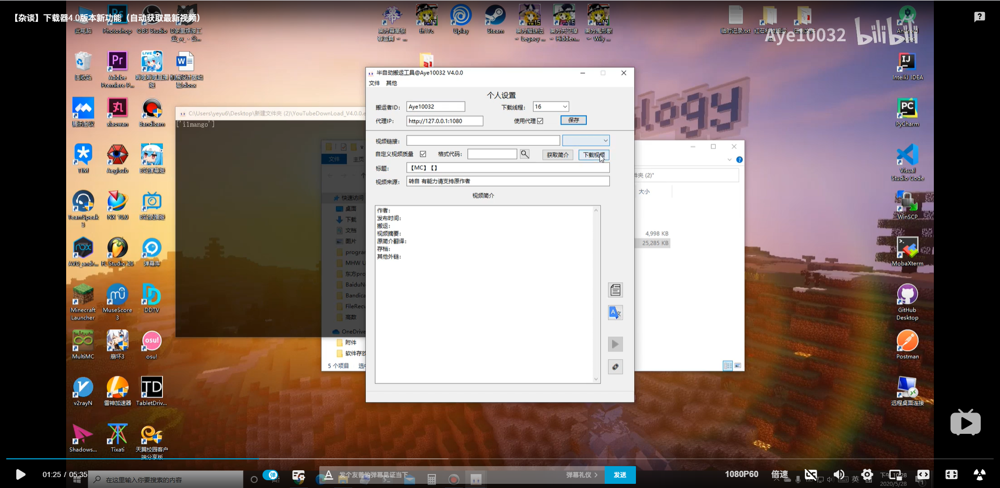

# Youtube Download

    

红石科技搬运组工具软件，用于自动下载视频，视频封面，字幕，同时规范简介格式。      
搬运组空间：[https://space.bilibili.com/1311124](https://space.bilibili.com/1311124)      
作者：Aye10032 [https://space.bilibili.com/40077740](https://space.bilibili.com/40077740)     
程序协助：Dazo66 [https://space.bilibili.com/5725331/](https://space.bilibili.com/5725331/)

## 依赖环境

Windows系统；        
代理软件;        

## 使用方法

将下载下来的exe文件放入一个新建文件夹中运行即可，第一次运行会在根目录下生成一些系统配置文件，之后正常运行即可。       
使用介绍视频：     

## 界面

设置搬运者ID，是否适用代理（如果代理是部署在路由器上选择不使用即可），以及代理IP，**代理必须是以http：//开头**，之后跟上IP及端口号即可。
这里编辑完毕后点击保存下次运行软件时会自动载入配置。

输入视频链接，点击下载按钮即可开始。运行结束后可以点击按钮复制简介部分的文字。     
你也可以仅点击**获取简介**按钮来仅获取简介信息而并不下载视频；       

对于自定义视频质量功能，在勾选该复选框并输入视频链接后，点击边上的搜索按钮获取视频可用格式列表，点击你要的音频及视频格式并关闭该窗口，之后点击会自动加载你选择的视频格式代码，如果想要修改格式重复上述动作即可。选择好格式之后点击下载视频按钮即可。     
如果你得电脑上装了ffmpeg程序会自动调用，没装会用默认方法合成音频及视频，但实际上也就慢一点点。

在视频信息编辑完成之后点击 “X” 关闭窗口，简介等信息会自动保存。或者手动点击 文件-保存 也可以保存未编辑完的视频，以便之后继续进行编辑。

点击 文件-加载 可以加载历史视频的标题、链接和简介信息。

### 简介框边功能按钮
- 点击🔗按钮可以跳转到油管原网页。
- 点击▶按钮会使用系统默认播放器播放视频。
- 点击谷歌翻译的logo可以弹出翻译对话框，不过因为发送格式的原因，目前不支持有换行的翻译。（也就是只能一段一段的翻译）
- 最后一个按钮可以一键将简介区内容复制到剪贴板，方便投稿时使用。

### 下载

GitHub:[下载地址](https://github.com/Aye10032/YouTubeDownLoader/releases/latest)        
Gitee(国内镜像):[下载地址](https://gitee.com/aye10032/YouTubeDownLoader/releases/v4.2.0)

### 引用

- [youtube-dl](https://github.com/ytdl-org/youtube-dl)
